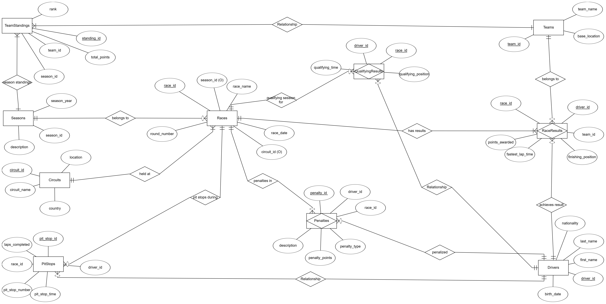

<h1 align="center">🏎️ Formula 1 Racing Management Database</h1>

<p align="center">
  <b>A PostgreSQL-powered analytics engine for high-performance motorsport data</b>
</p>

<p align="center">
  
  
  
  
</p>

<p align="center">
  <i>From raw Formula 1 race data to normalized, queryable insights.</i>
</p>

---

## 📌 Table of Contents

- [Overview](#-overview)
- [Key Features](#-key-features)
- [Data Model](#-data-model)
- [Tech Stack](#-tech-stack)
- [Project Structure](#-project-structure)
- [Getting Started](#-getting-started)
- [Example Queries](#-example-queries)
- [Indexing & Optimization](#-indexing--optimization)
- [Future Improvements](#-future-improvements)
- [Authors](#-authors)
- [License](#-license)

---

## 🧩 Overview

This project implements a **Formula 1 Racing Season Management Database** in **PostgreSQL**, designed to support:

- Real-time race insights
- Historical performance analytics
- Clean data integrity across multiple seasons

It models everything from **seasons, races, drivers, teams, circuits** to **pit stops, penalties, qualifying results, and team standings**, all in **BCNF** and backed by synthetic data generated with Python’s `Faker` library.

> ✅ Perfect as a portfolio database project and a foundation for analytics dashboards, visualization, or simulation tools.

---

## ✨ Key Features

- 🧱 **BCNF-Normalized Schema**  
  10 carefully designed relations with clear primary & foreign key constraints.

- 📊 **Rich Racing Domain Coverage**  
  Seasons, races, circuits, drivers, teams, race results, qualifying sessions, pit stops, penalties, and team standings.

- 🧪 **Synthetic Dataset (3000+ rows/table)**  
  Python + Faker script to generate realistic fake F1-style data and export it as CSV.

- ⚙️ **Advanced SQL Logic**  
  - Stored procedures & functions  
  - Transactions & error handling  
  - Triggers for automatic logging  
  - Window functions for ranking & history

- 🚀 **Performance-Tuned**  
  Indexed queries, `EXPLAIN ANALYZE`-based tuning, composite and B-tree indexes for faster reads.

- 📄 **Report Included**  
  Full academic-style PDF report with ER diagram, design decisions, and screenshots of executions.

---

## 🗺️ Data Model

The core schema consists of 10 main tables:

| Entity            | Description                                           |
|-------------------|-------------------------------------------------------|
| `Seasons`         | F1 seasons (year, description)                        |
| `Drivers`         | Driver profiles & demographics                        |
| `Teams`           | Teams, base locations                                 |
| `Circuits`        | Race circuits (name, location, country)              |
| `Races`           | Individual race events per season                     |
| `QualifyingResults` | Qualifying session results per race & driver      |
| `RaceResults`     | Final race classification & points                    |
| `PitStops`        | Pit stop logs per driver & race                       |
| `Penalties`       | Penalties assigned to drivers in races                |
| `TeamStandings`   | Season-wise team total points & rank                  |


<p align="center">
  
</p>

🛠 Tech Stack

Database: PostgreSQL 15+

Language: SQL / PL/pgSQL

Data Generation: Python + Faker

Tools: pgAdmin, psql

📂 Project Structure

Suggested repository layout:
```text

formula1-racing-db/
├── sql/
│   ├── create.sql        

├── data/
│   ├── seasons.csv
│   ├── drivers.csv
│   ├── teams.csv
│   ├── circuits.csv
│   ├── races.csv
│   ├── raceresults.csv
│   ├── qualifyingresults.csv
│   ├── pitstops.csv
│   ├── penalties.csv
│   └── teamstandings.csv
├── generator/
│   └── formula1_data_generation.py      # Faker-based data generator
├── assets/
│   └── er_diagram.png             # (Optional) ER diagram image
├── report.pdf                     # Final project report
├── requirements.txt               # Python dependencies (Faker, etc.)
├── .gitignore
├── LICENSE                        # MIT License
└── README.md
```
⚡ Indexing & Optimization

Using EXPLAIN ANALYZE, we:

Identified sequential scans on large tables

Added targeted B-tree and composite indexes (e.g., (driver_id, race_id DESC))

Reduced execution times for:

Driver point aggregation

Fetching recent races by driver

Joining races with circuits by date

You can replay these optimizations using:

\i sql/indexing.sql

📜 License

This project is licensed under the **MIT License**.  
See the full license here: **[LICENSE](LICENSE)**.
